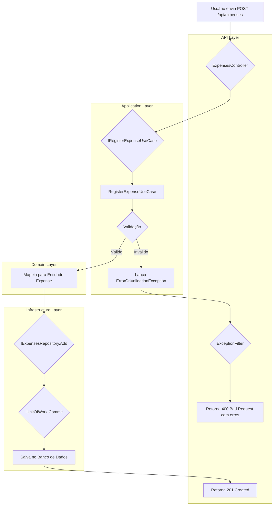
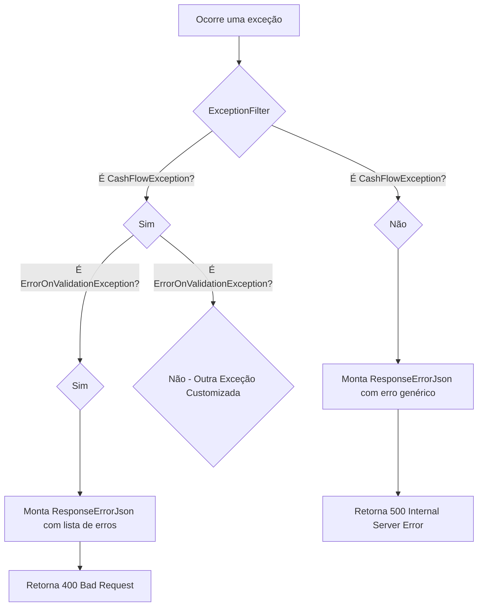
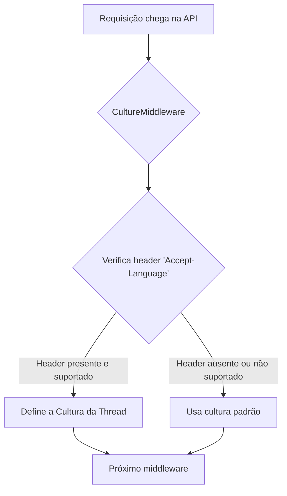

# CashFlow API

API para gerenciamento de fluxo de caixa (CashFlow), permitindo o registro de despesas.

## Estrutura do Projeto

O projeto segue uma arquitetura de Clean Architecture, dividida nas seguintes camadas:

- **CashFlow.API:** Camada de apresentação, responsável por expor os endpoints da API.
- **CashFlow.Application:** Camada de aplicação, contendo a lógica de negócio e os casos de uso.
- **CashFlow.Domain:** Camada de domínio, com as entidades principais e as interfaces dos repositórios.
- **CashFlow.Communication:** Camada de comunicação, definindo os DTOs (Data Transfer Objects) para requisições e respostas.
- **CashFlow.Infrastructure:** Camada de infraestrutura, responsável pela implementação do acesso a dados e outras dependências externas.
- **CashFlow.Exception:** Camada de exceções, contendo as exceções customizadas da aplicação.

## Funcionalidades

### Registro de Despesas

A API permite o registro de novas despesas através do endpoint `POST /api/expenses`.

**Request:**

```json
{
  "title": "Compra de material de escritório",
  "description": "Canetas e post-its",
  "amount": 50.75,
  "date": "2024-05-20T14:00:00",
  "paymentType": 1
}
```

**Response:**

- **201 Created:** Em caso de sucesso, com o corpo da resposta vazio.
- **400 Bad Request:** Em caso de dados inválidos na requisição.
- **500 Internal Server Error:** Em caso de erro inesperado no servidor.

## Entendendo o fluxo do projeto

### Fluxo de Registro de Despesa

O fluxograma abaixo descreve o processo de registro de uma nova despesa no sistema.



### Fluxo de Tratamento de Exceções

O sistema possui um filtro de exceções para padronizar as respostas de erro.



### Fluxo de Internacionalização (i18n)

O `CultureMiddleware` permite que as mensagens de erro sejam traduzidas com base no header `Accept-Language` da requisição.



## Estrutura de Testes

A pasta `tests` contém os projetos de teste da solução, garantindo a qualidade e o correto funcionamento da API.

- **CommonTestUtilities:** Projeto que fornece utilitários para os testes, como a geração de dados falsos (`Bogus`) para as requisições. Isso facilita a criação de cenários de teste consistentes e variados.

- **Validator.Tests:** Projeto de testes unitários para as validações da aplicação. Utiliza o framework `xUnit` para a execução dos testes e as bibliotecas `FluentAssertions` e `Shouldly` para as asserções, tornando os testes mais legíveis e expressivos.